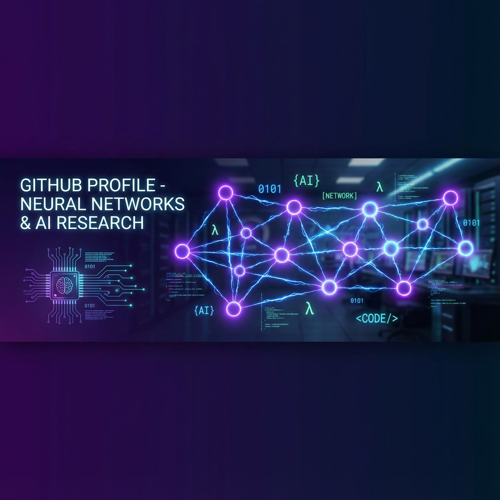

<div align="center">

<!-- HEADER BANNER -->


<br/><br/>

#  `malachihooper.json`

[](https://instagram.com/malachihooper.json)
[](mailto:malllachi@proton.me)
[](https://github.com/malachihooper)

</div>

---

<div align="center">

### `> INITIALIZING HANDSHAKE...`
### `> PEER DISCOVERED. WELCOME.`

</div>

---

##  Research Interests

<table>
<tr>
<td width="50%">

```
┌──────────────────────────────┐
│   NEURAL NETWORKS          │
│   NETWORK COMMUNICATIONS   │
│   PEER-TO-PEER TECH        │
└──────────────────────────────┘
```

</td>
<td width="50%">

```
┌──────────────────────────────┐
│  CROSS-PLATFORM HANDSHAKE │
│  ACTIVE AI SELF-TRAINING  │
│  CODING AGENTS            │
└──────────────────────────────┘
```

</td>
</tr>
</table>

---

## Languages

<div align="center">


</div>

---

<div align="center">

## NIGHTFRAME


### *An Autonomous Mesh System*

</div>

---

### What is Nightframe?

|---------|-------------|
| ** Drone Mesh** | Distributed nodes that form an intelligent swarm network |
| ** OpenNet** | Universal network discovery & cross-platform handshake protocol |
| ** Self-Training** | Agents that improve through active learning cycles |
| ** Captive Portal** | Intelligent access point with platform-aware SSID broadcasting |

</details>

<details>
<summary><b> Architecture Overview</b></summary>

<br/>

```
                    ┌─────────────────────────────────────┐
                    │         NIGHTFRAME CORE             │
                    │   ┌─────────────────────────────┐   │
                    │   │    Neural Training Engine   │   │
                    │   │   ┌─────────┐ ┌─────────┐   │   │
                    │   │   │ Hybrid  │ │  LSTM   │   │   │
                    │   │   │   CNN   │ │ Layer   │   │   │
                    │   │   └────┬────┘ └────┬────┘   │   │
                    │   │        └─────┬─────┘        │   │
                    │   │              ▼              │   │
                    │   │      ┌─────────────┐        │   │
                    │   │      │ Attention   │        │   │
                    │   │      │   Layer     │        │   │
                    │   │      └──────┬──────┘        │   │
                    │   └─────────────┼───────────────┘   │
                    │                 ▼                   │
                    │    ┌────────────────────────┐       │
                    │    │     DRONE MESH         │       │
                    │    │  ┌───┐   ┌───┐   ┌───┐ │       │
                    │    │  │ D │◄─►│ D │◄─►│ D │ │       │
                    │    │  └─┬─┘   └─┬─┘   └─┬─┘ │       │
                    │    │    └───────┼───────┘   │       │
                    │    └────────────┼───────────┘       │
                    │                 ▼                   │
                    │         ┌─────────────┐             │
                    │         │   OpenNet   │             │
                    │         │  Protocol   │             │
                    │         └─────────────┘             │
                    └─────────────────────────────────────┘
                                      │
                    ┌─────────────────┼─────────────────┐
                    ▼                 ▼                 ▼
              ┌──────────┐    ┌──────────────┐   ┌───────────┐
              │ Windows  │    │    Linux     │   │   macOS   │
              └──────────┘    └──────────────┘   └───────────┘
```

</details>

<details>
<summary><b> Self-Training Loop</b></summary>

<br/>

```python
# NIGHTFRAME Self-Training Cycle (Simplified)

class NightframeAgent:
    def __init__(self):
        self.model = HybridCNNLSTM()
        self.attention = AttentionLayer()
        self.memory = ExperienceBuffer()
    
    def training_cycle(self):
        while self.active:
            # 1. Observe environment
            observations = self.gather_data()
            
            # 2. Process through neural network
            embeddings = self.model.forward(observations)
            context = self.attention.focus(embeddings)
            
            # 3. Generate response
            action = self.decide(context)
            
            # 4. Execute and learn
            reward = self.execute(action)
            self.memory.store(observations, action, reward)
            
            # 5. Self-improve
            self.model.train(self.memory.sample())
```

</details>

<details>
<summary><b>📡 Peer Discovery</b></summary>

<br/>

```csharp
// OpenNet Cross-Platform Handshake

public class OpenNetProtocol
{
    public async Task<PeerConnection> DiscoverPeers()
    {
        // Platform-aware SSID broadcasting
        var ssid = PlatformEvaluator.GetOptimalSSID();
        
        // Broadcast presence
        await CaptivePortal.StartAccessPoint(ssid);
        
        // Listen for handshake requests
        var peer = await WaitForHandshake();
        
        // Establish encrypted mesh connection
        return await EstablishMeshLink(peer);
    }
}
```

</details>
```

---

## 🌐 Connect

<div align="center">

| Platform | Link |
|:--------:|:----:|
| 📸 **Instagram** | [@malachihooper.json](https://instagram.com/malachihooper.json) |
| 📧 **Email** | [malllachi@proton.me](mailto:malllachi@proton.me) |


<br/>

---

</div>

