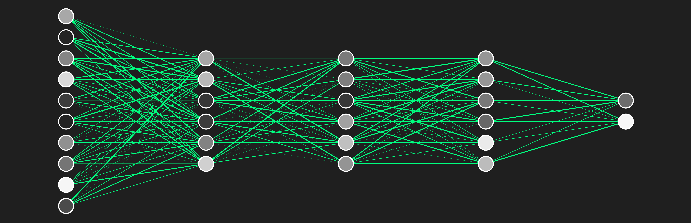

<div align="center">

<!-- HEADER BANNER -->
                                                                                                                                            
### `Malachi's`
                                                                                                                                            
## `Library of Developments`

[](https://instagram.com/m.alachii)
[](https://github.com/malachihooper-json)



</div>

---

<div align="center">

### `> Various Focuses `
### `> Texas Tech`

</div>

---

## What am I working on?:
NOW - I have just published a bash-based easy to use generator that creates 4k Binaural Beat Youtube Videos that are  High Quality at over 10 hours long, all rendered in UNDER 45 minutes! "IsochronicToneGen"
SEPTEMBER -I am focusing on adaptive mesh networks using machine learning. I have also just released a plug-and-play peer-to-peer mesh network library for distributed computation on .NET/C# systems (8). This requires Powershell accessibility and is durable to changing network conditions.

<table>
<tr>
<td width="50%">

```
┌──────────────────────────────┐
│  Neural Networks             |
│  Music and Audio             │
│  Peer-To-Peer Protocols      │
└──────────────────────────────┘
```

</td>
<td width="50%">

```
┌──────────────────────────────┐
│  Cross-Platform Inter-op     │
│  Active ML Self-Critique     │
│  Embedded Coding Agents      │
└──────────────────────────────┘
```

</td>
</tr>
</table>

---

## Proficiencies

<div align="center">


</div>

---

<div align="center">

# Project: IsochronicToneGen for MACBOOK or PC

An easy to use rapid 4k video generator that contains custom binaural or isochronic frequencies and is rendered in under 45 minutes!

---

| Description |
|---------|-------------|
| **User-Settings** | User selects length of video, frequency, Hz, Carrier tone, etc. |
| **Rapid 4k Encoding** | Develop a working 4k Video of your newly generated audio in RECORD time |
| **Video Options** | There are options to include visuals, or keep it simple with black and white utility-style videos |

# Project: Nightframe

A distributed computing platform that enables collaborative neural network inference across a mesh of autonomous nodes. Features cellular intelligence, GPU-accelerated ONNX runtime, and viral network propagation.

---

| Description |
|---------|-------------|
| **Distributed Inference** | Pipeline-parallel model sharding across nodes |
| **Cellular Intelligence** | RF fingerprinting and handover prediction |
| **Neural Compute** | ONNX Runtime with GPU acceleration (CUDA, DirectML, CoreML) |
| **Mesh Discovery** | UDP broadcast + mDNS peer discovery |
| **Captive Portal** | Platform-aware network propagation |
| **Credit Economy** | Incentivized compute contribution |


```
┌─────────────────────────────────────────────────────────────────────────────┐
│                         WEB CONSOLE (React/Next.js)                          │
└───────────────────────────────────────┬─────────────────────────────────────┘
                                        │ SignalR WebSocket
                                        ▼
┌─────────────────────────────────────────────────────────────────────────────┐
│                        ORCHESTRATOR (Command Node)                           │
│                        ASP.NET Core + gRPC                                   │
├─────────────────────────────────────────────────────────────────────────────┤
│  Drone Registry │ Ledger Service │ Shard Coordinator │ Cell Coordinator     │
└───────────────────────────────────────┬─────────────────────────────────────┘
                                        │ gRPC bidirectional streaming
                        ┌───────────────┼───────────────┐
                        ▼               ▼               ▼
                  ┌─────────┐     ┌─────────┐     ┌─────────┐
                  │ DESKTOP │     │  SCOUT  │     │ ANDROID │
                  │  DRONE  │     │  DRONE  │     │  SCOUT  │
                  │─────────│     │─────────│     │─────────│
                  │ Compute │     │ Cellular│     │ Wi-Fi   │
                  │ Storage │     │ RF Loc  │     │ Scanning│
                  │ Gateway │     │ Predict │     │ GPS Map │
                  └─────────┘     └─────────┘     └─────────┘
```

---


## License

Copyright © 2024 Malachi Hooper. All rights reserved.

---


</details>

---
```
```
---

## Contact

<div align="center">

| Platform | Link |
|:--------:|:----:|
| **Instagram** | [@m.alachii](https://instagram.com/m.alachii) |
| **Email** | [malllachi@proton.me](mailto:malllachi@proton.me) |

<br/>

```
╔═══════════════════════════════════════════════════════════╗
║                                                           ║
║   malachihooper.json GITHUB                               ║
║                                                           ║
╚═══════════════════════════════════════════════════════════╝
____________________________________________________________
__________________________________________________________
```

<br/>

</div>

---

<sub><sup>

`▓▒░ signal.processing ░▒▓` `▓▒░ mesh.network ░▒▓` `▓▒░ swarm.intelligence ░▒▓`
`░▒▓ rf.fingerprinting ▓▒░` `░▒▓ geolocation ▓▒░` `░▒▓ spectrum.analysis ▓▒░`
`▓░▒ distributed.compute ▒░▓` `▓░▒ autonomous.agents ▒░▓` `▓░▒ neural.security ▒░▓`
░▒▓██████████████▓▒░ ░▒▓██████▓▒░░▒▓█▓▒░       ░▒▓██████▓▒░ ░▒▓██████▓▒░░▒▓█▓▒░░▒▓█▓▒░▒▓█▓▒░      ░▒▓█▓▒░░▒▓█▓▒░░▒▓██████▓▒░ ░▒▓██████▓▒░░▒▓███████▓▒░░▒▓████████▓▒░▒▓███████▓▒░  
░▒▓█▓▒░░▒▓█▓▒░░▒▓█▓▒░▒▓█▓▒░░▒▓█▓▒░▒▓█▓▒░      ░▒▓█▓▒░░▒▓█▓▒░▒▓█▓▒░░▒▓█▓▒░▒▓█▓▒░░▒▓█▓▒░▒▓█▓▒░      ░▒▓█▓▒░░▒▓█▓▒░▒▓█▓▒░░▒▓█▓▒░▒▓█▓▒░░▒▓█▓▒░▒▓█▓▒░░▒▓█▓▒░▒▓█▓▒░      ░▒▓█▓▒░░▒▓█▓▒░ 
░▒▓█▓▒░░▒▓█▓▒░░▒▓█▓▒░▒▓█▓▒░░▒▓█▓▒░▒▓█▓▒░      ░▒▓█▓▒░░▒▓█▓▒░▒▓█▓▒░      ░▒▓█▓▒░░▒▓█▓▒░▒▓█▓▒░      ░▒▓█▓▒░░▒▓█▓▒░▒▓█▓▒░░▒▓█▓▒░▒▓█▓▒░░▒▓█▓▒░▒▓█▓▒░░▒▓█▓▒░▒▓█▓▒░      ░▒▓█▓▒░░▒▓█▓▒░ 
░▒▓█▓▒░░▒▓█▓▒░░▒▓█▓▒░▒▓████████▓▒░▒▓█▓▒░      ░▒▓████████▓▒░▒▓█▓▒░      ░▒▓████████▓▒░▒▓█▓▒░      ░▒▓████████▓▒░▒▓█▓▒░░▒▓█▓▒░▒▓█▓▒░░▒▓█▓▒░▒▓███████▓▒░░▒▓██████▓▒░ ░▒▓███████▓▒░  
░▒▓█▓▒░░▒▓█▓▒░░▒▓█▓▒░▒▓█▓▒░░▒▓█▓▒░▒▓█▓▒░      ░▒▓█▓▒░░▒▓█▓▒░▒▓█▓▒░      ░▒▓█▓▒░░▒▓█▓▒░▒▓█▓▒░      ░▒▓█▓▒░░▒▓█▓▒░▒▓█▓▒░░▒▓█▓▒░▒▓█▓▒░░▒▓█▓▒░▒▓█▓▒░      ░▒▓█▓▒░      ░▒▓█▓▒░░▒▓█▓▒░ 
░▒▓█▓▒░░▒▓█▓▒░░▒▓█▓▒░▒▓█▓▒░░▒▓█▓▒░▒▓█▓▒░      ░▒▓█▓▒░░▒▓█▓▒░▒▓█▓▒░░▒▓█▓▒░▒▓█▓▒░░▒▓█▓▒░▒▓█▓▒░      ░▒▓█▓▒░░▒▓█▓▒░▒▓█▓▒░░▒▓█▓▒░▒▓█▓▒░░▒▓█▓▒░▒▓█▓▒░      ░▒▓█▓▒░      ░▒▓█▓▒░░▒▓█▓▒░ 
░▒▓█▓▒░░▒▓█▓▒░░▒▓█▓▒░▒▓█▓▒░░▒▓█▓▒░▒▓████████▓▒░▒▓█▓▒░░▒▓█▓▒░░▒▓██████▓▒░░▒▓█▓▒░░▒▓█▓▒░▒▓█▓▒░      ░▒▓█▓▒░░▒▓█▓▒░░▒▓██████▓▒░ ░▒▓██████▓▒░░▒▓█▓▒░      ░▒▓████████▓▒░▒▓█▓▒░░▒▓█▓▒░                                                                                                                                                                 
</sup></sub>

<!--
╔══════════════════════════════════════════════════════════════════════════════╗
║ SIGINT signals-intelligence ELINT electronic-intelligence COMINT            ║
║ communications-intelligence MASINT measurement-signature-intelligence       ║
║ GEOINT geospatial-intelligence OSINT open-source-intelligence              ║
║ HUMINT human-intelligence IMINT imagery-intelligence TECHINT               ║
║ autonomous-systems swarm-robotics mesh-networking distributed-computing     ║
║ neural-network-security adversarial-machine-learning rf-fingerprinting     ║
║ spectrum-analysis signal-processing cognitive-radio software-defined-radio ║
║ peer-to-peer-protocols distributed-ledger zero-trust-architecture          ║
║ edge-computing fog-computing autonomous-navigation path-planning           ║
║ sensor-fusion multi-agent-systems reinforcement-learning transfer-learning ║
║ federated-learning privacy-preserving-ml secure-multiparty-computation     ║
║ homomorphic-encryption post-quantum-cryptography lattice-cryptography      ║
║ DARPA IARPA ARPA-E defense-research advanced-research military-ai         ║
║ tactical-communications battlefield-networks mobile-ad-hoc-networks MANET ║
║ delay-tolerant-networking DTN store-and-forward opportunistic-routing     ║
║ cognitive-electronic-warfare spectrum-dominance electronic-countermeasures║
║ radar-cross-section stealth-technology metamaterials antenna-design       ║
║ phased-array beamforming MIMO massive-MIMO millimeter-wave 5G-NR 6G       ║
║ satellite-communications LEO-constellations inter-satellite-links ISL    ║
║ drone-swarm UAV UAS unmanned-systems autonomous-vehicles robotics        ║
║ computer-vision object-detection tracking-algorithms SLAM localization   ║
║ inertial-navigation GPS-denied-navigation terrain-matching TERCOM        ║
║ cryptanalysis side-channel-attacks fault-injection hardware-security     ║
║ trusted-execution-environment secure-enclave ARM-TrustZone Intel-SGX     ║
║ reverse-engineering malware-analysis binary-exploitation vulnerability   ║
║ penetration-testing red-team blue-team purple-team threat-intelligence   ║
║ cyber-physical-systems SCADA ICS critical-infrastructure industrial-IoT  ║
║ quantum-computing quantum-sensing quantum-communication QKD entanglement ║
║ neuromorphic-computing spiking-neural-networks brain-inspired-computing  ║
║ hypersonic aerodynamics propulsion materials-science high-temperature    ║
║ directed-energy laser-weapons microwave-weapons electromagnetic-pulse EMP║
║ synthetic-aperture-radar SAR inverse-SAR ground-penetrating-radar GPR    ║
║ acoustic-sensing sonar underwater-communications submarine-detection     ║
║ biometric-identification facial-recognition gait-analysis behavioral-bio ║
║ natural-language-processing sentiment-analysis named-entity-recognition  ║
║ knowledge-graphs semantic-web ontology-engineering information-extraction║
╚══════════════════════════════════════════════════════════════════════════════╝

research: arxiv ieee acm springer nature science proceedings conference journal
publications: preprint peer-reviewed citations h-index impact-factor scholarly
institutions: MIT Stanford Berkeley CMU Caltech Georgia-Tech Princeton
laboratories: Lincoln-Lab APL Sandia Los-Alamos Oak-Ridge PNNL Argonne
agencies: NSF DOE DOD NIST NASA NRL ONR AFRL AFOSR ARO DARPA IARPA
programs: SBIR STTR BAA RFI RFP contract grant fellowship research-award

keywords: machine-learning deep-learning artificial-intelligence AI ML DL NN
frameworks: TensorFlow PyTorch JAX Keras MXNet Caffe ONNX TensorRT OpenVINO
languages: Python C++ Rust Julia CUDA OpenCL SYCL HIP ROCm MLIR XLA
hardware: GPU TPU NPU FPGA ASIC neuromorphic edge-accelerator inference-chip
-->

<sub><sup>

`⠀⠀⠀⠋⠁⠉⠓⠊⠝⠑⠀⠇⠑⠁⠗⠝⠊⠝⠛⠀⠀⠀` `⠀⠀⠙⠑⠑⠏⠀⠇⠑⠁⠗⠝⠊⠝⠛⠀⠀⠀` `⠀⠀⠝⠑⠥⠗⠁⠇⠀⠝⠑⠞⠺⠕⠗⠅⠎⠀⠀⠀`
`⠎⠊⠛⠝⠁⠇⠎⠀⠊⠝⠞⠑⠇⠇⠊⠛⠑⠝⠉⠑` `⠉⠕⠍⠏⠥⠞⠑⠗⠀⠧⠊⠎⠊⠕⠝` `⠁⠥⠞⠕⠝⠕⠍⠕⠥⠎⠀⠎⠽⠎⠞⠑⠍⠎`

</sup></sub>

<!-- 
p2p mesh swarm distributed autonomous self-organizing emergent behavior
tactical edge computing fog nodes gateway relay bridge router switch
spectrum sensing cognitive radio dynamic spectrum access frequency hopping
spread spectrum FHSS DSSS OFDM modulation demodulation encoding decoding
encryption authentication authorization access control identity management
-->


